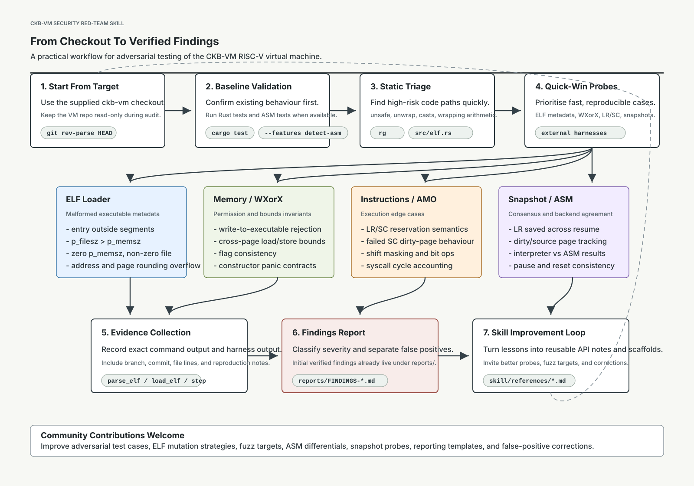

# ckb-vm-security-redteam

`ckb-vm-security-redteam` is a security red-team skill for adversarial testing of the CKB-VM RISC-V virtual machine.

As CellScript becomes increasingly mature, my recent work has focused on on-chain acceptance gates, security, auditability, and verification across the stack. CKB-VM is the execution foundation beneath CellScript, so strengthening the VM also strengthens the language-to-VM ecosystem.

This skill is designed to make CKB-VM security review more systematic, reproducible, and easier for the community to improve.

## Workflow

## What It Covers

- ELF loader adversarial cases
- memory safety and WXorX invariants
- instruction execution edge cases
- AMO, LR/SC, and dirty-page behaviour
- snapshot and resume consistency
- cycle accounting
- ASM backend vs Rust interpreter divergence
- practical API notes for writing compile-ready adversarial tests
- findings templates and false-positive tracking

## Repository Structure

- `skill/SKILL.md` - the main red-team skill
- `skill/references/test-patterns.md` - compile-oriented test scaffolds and API notes
- `skill/references/verified-findings.md` - latest verified findings and false-positive corrections
- `reports/` - findings from live red-team passes
- `reports/assets/` - diagrams and supporting visual material

## Initial Findings

Some initial findings from a live red-team pass are already documented in:

- `reports/FINDINGS-2026-06-04.md`

## Contributing

Community improvements are welcome. Useful contributions include:

- better adversarial test cases
- malformed ELF generation strategies
- new fuzz targets
- ASM/interpreter differential tests
- snapshot consistency probes
- corrections to inaccurate assumptions
- clearer reporting templates

The current version is a starting point for collaborative, repeatable CKB-VM security research.
